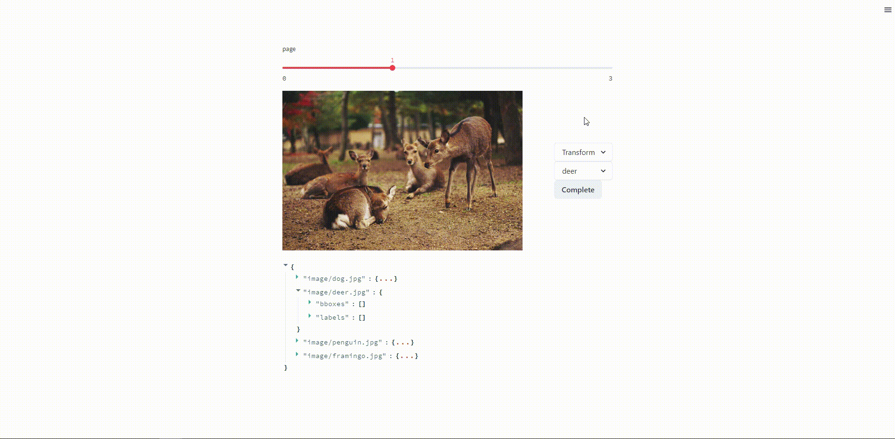

# Streamlit Image Annotation

Streamlit component for image annotation.

[](https://st-image-annotation.streamlit.app/)
[](https://pypi.org/project/streamlit-image-annotation/)

# Features
* You can easily launch an image annotation tool using streamlit.
* By customizing the pre- and post-processing, you can achieve your preferred annotation workflow.
* Currently supports classification, detection, point detection tasks.
* Simple UI that is easy to navigate.

# Install

```sh
pip install streamlit-image-annotation
```

# Example Usage
If you want to see other use cases, please check inside the examples folder.

```python
from glob import glob
import pandas as pd
import streamlit as st
from streamlit_image_annotation import classification

label_list = ['deer', 'human', 'dog', 'penguin', 'framingo', 'teddy bear']
image_path_list = glob('image/*.jpg')
if 'result_df' not in st.session_state:
    st.session_state['result_df'] = pd.DataFrame.from_dict({'image': image_path_list, 'label': [0]*len(image_path_list)}).copy()

num_page = st.slider('page', 0, len(image_path_list)-1, 0)
label = classification(image_path_list[num_page], 
                        label_list=label_list, 
                        default_label_index=int(st.session_state['result_df'].loc[num_page, 'label']))

if label is not None and label['label'] != st.session_state['result_df'].loc[num_page, 'label']:
    st.session_state['result_df'].loc[num_page, 'label'] = label_list.index(label['label'])
st.table(st.session_state['result_df'])
```

# API

```python
classification(
    image_path: str,
    label_list: List[str],
    default_label_index: Optional[int] = None,
    height: int = 512,
    width: int = 512,
    key: Optional[str] = None
)
```

- **image_path**: Image path.
- **label_list**: List of label candidates.
- **default_label_index**: Initial label index.
- **height**: The maximum height of the displayed image.
- **width**: The maximum width of the displayed image.
- **key**: An optional string to use as the unique key for the widget. Assign a key so the component is not remount every time the script is rerun.

- **Component Value**: {'label': label_name}

Example: [example code](example/classification.py)

```python
detection(
    image_path: str,
    label_list: List[str],
    bboxes: Optional[List[List[int, int, int, int]]] = None,
    labels: Optional[List[int]] = None,
    height: int = 512,
    width: int = 512,
    key: Optional[str] = None
)
```

- **image_path**: Image path.
- **label_list**: List of label candidates.
- **bboxes**: Initial list of bounding boxes, where each bbox is in the format [x, y, w, h].
- **labels**: List of label for each initial bbox.
- **height**: The maximum height of the displayed image.
- **width**: The maximum width of the displayed image.
- **key**: An optional string to use as the unique key for the widget. Assign a key so the component is not remount every time the script is rerun.

- **Component Value**: \[{'bbox':[x,y,width, height], 'label_id': label_id, 'label': label_name},...\]

Example: [example code](example/detection.py)

```python
pointdet(
    image_path: str,
    label_list: List[str],
    points: Optional[List[List[int, int]]] = None,
    labels: Optional[List[int]] = None,
    height: int = 512,
    width: int = 512,
    key: Optional[str] = None
)
```

- **image_path**: Image path.
- **label_list**: List of label candidates.
- **points**: Initial list of points, where each point is in the format [x, y].
- **labels**: List of label for each initial bbox.
- **height**: The maximum height of the displayed image.
- **width**: The maximum width of the displayed image.
- **key**: An optional string to use as the unique key for the widget. Assign a key so the component is not remount every time the script is rerun.

- **Component Value**: \[{'bbox':[x,y], 'label_id': label_id, 'label': label_name},...\]

Example: [example code](example/pointdet.py)

# Future Work
* Addition of component for segmentation task.

