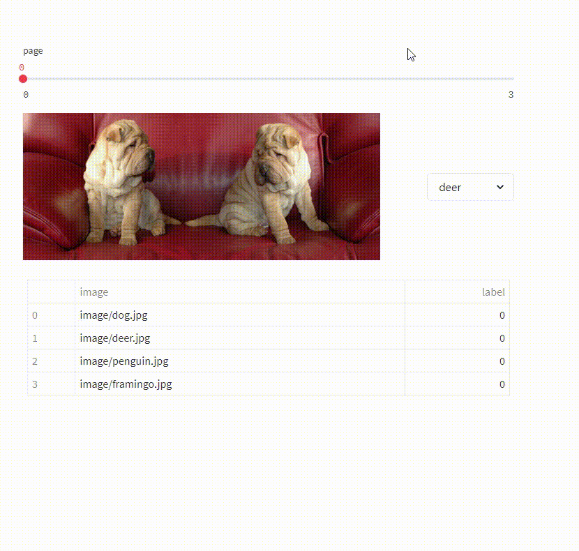
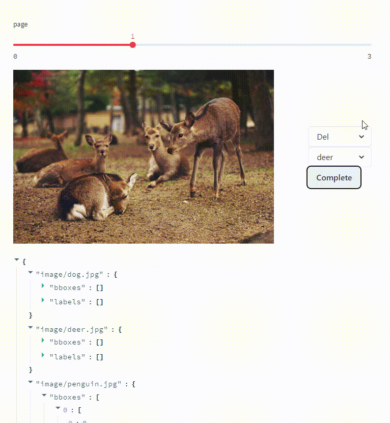
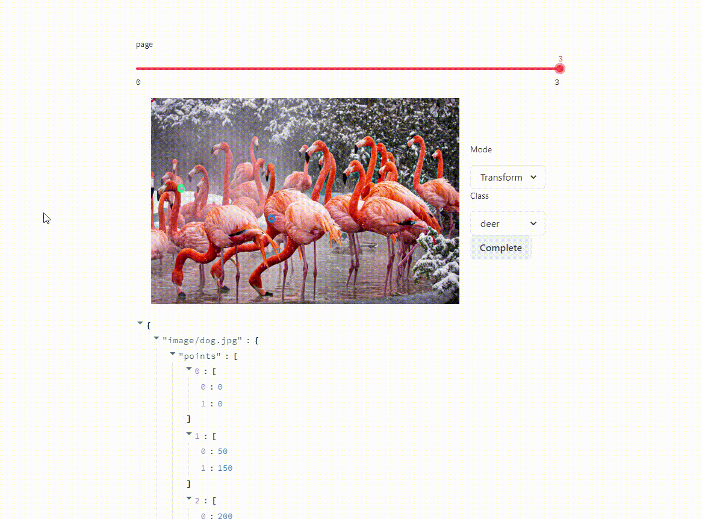

# Examples
## Classification
```
streamlit run classification.py
```

## Detection
```
streamlit run detection.py
```


## Point Detection
```
streamlit run pointdet.py
```


## Segmentation via SAM
```
streamlit run sam_segmentation.py
```

